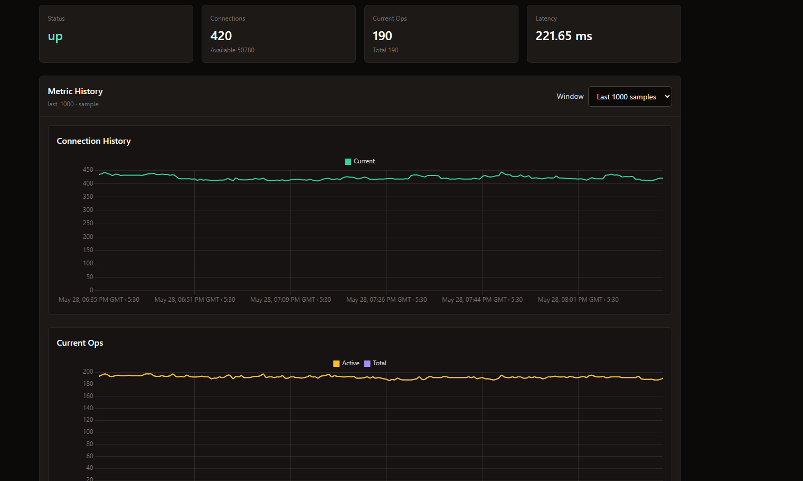
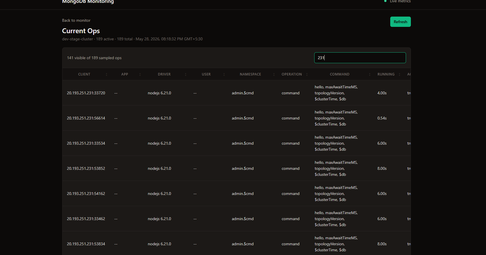

# MongoDB Monitoring

Simple FastAPI, HTMX, Celery, Redis, and MongoDB monitoring app.

## What it does

- Shows user-provided MongoDB connection status in a dark HTMX dashboard.
- Keeps monitoring data behind JSON API endpoints; UI pages fetch from `/api` and render client-side.
- Stores monitoring metadata and time-series samples in a separate MongoDB service.
- Uses Redis as the Celery broker/result backend.
- Runs separate Celery tasks for server status, connection counts, current operations, database stats, and collection stats.
- Supports optional HTTP Basic auth for the whole app through `.env`.

## Screenshots




## Run locally with Docker

Create an env file:

```bash
cp .env.example .env
```

Start the development stack:

```bash
docker compose -f docker-compose.dev.yml up --build
```

Open:

```text
http://localhost:8000
```

The compose stack includes:

- `api`: FastAPI app
- `worker`: Celery worker
- `beat`: Celery periodic scheduler
- `redis`: Celery broker
- `metadata-mongodb`: stores monitors and metric samples

## MongoDB target permissions

The MongoDB user configured for a monitored target needs enough access to read server status, current operations, database stats, collection stats, and local replication metadata. Grant these roles:

```javascript
[
  { role: "clusterMonitor", db: "admin" },
  { role: "read", db: "local" },
  { role: "readAnyDatabase", db: "admin" },
]
```

Example `mongosh` user creation:

```javascript
use admin

db.createUser({
  user: "mongodb-monitor",
  pwd: passwordPrompt(),
  roles: [
    { role: "clusterMonitor", db: "admin" },
    { role: "read", db: "local" },
    { role: "readAnyDatabase", db: "admin" },
  ],
})
```

## Environment variables

Copy `.env.example` to `.env` and adjust as needed.

| Variable | Default | Description |
|---|---|---|
| `APP_NAME` | `MongoDB Monitoring` | Display name shown in the UI header |
| `ENCRYPTION_KEY` | _(empty)_ | Fernet key for encrypting stored MongoDB connection strings. If blank, URIs are stored as plaintext. Generate with `python -c "from cryptography.fernet import Fernet; print(Fernet.generate_key().decode())"` |
| `AUTH_ENABLED` | `false` | Set to `true` to protect the whole app with HTTP Basic auth |
| `AUTH_USERNAME` | `admin` | Basic auth username (only used when `AUTH_ENABLED=true`) |
| `AUTH_PASSWORD` | `admin` | Basic auth password (only used when `AUTH_ENABLED=true`) |
| `METADATA_MONGO_URI` | `mongodb://metadata-mongodb:27017` | Connection URI for the metadata MongoDB that stores monitors and metric samples |
| `METADATA_MONGO_DB` | `mongodb_monitoring` | Database name inside the metadata MongoDB |
| `REDIS_URL` | `redis://redis:6379/0` | Redis URL used as the Celery task broker |
| `CELERY_RESULT_BACKEND` | `redis://redis:6379/1` | Redis URL used to store Celery task results |
| `MONITOR_INTERVAL_SECONDS` | `30` | How often (seconds) the worker runs server-status, connection-count, and current-ops checks. Minimum `5` |
| `STORAGE_STATS_INTERVAL_SECONDS` | `300` | How often (seconds) the worker collects database and collection storage stats. Minimum `60` |

## Optional Basic Auth

Set this in `.env`:

```env
AUTH_ENABLED=true
AUTH_USERNAME=admin
AUTH_PASSWORD=change-me
```

## Production-style compose

```bash
docker compose -f docker-compose.prod.yml up --build -d
```
